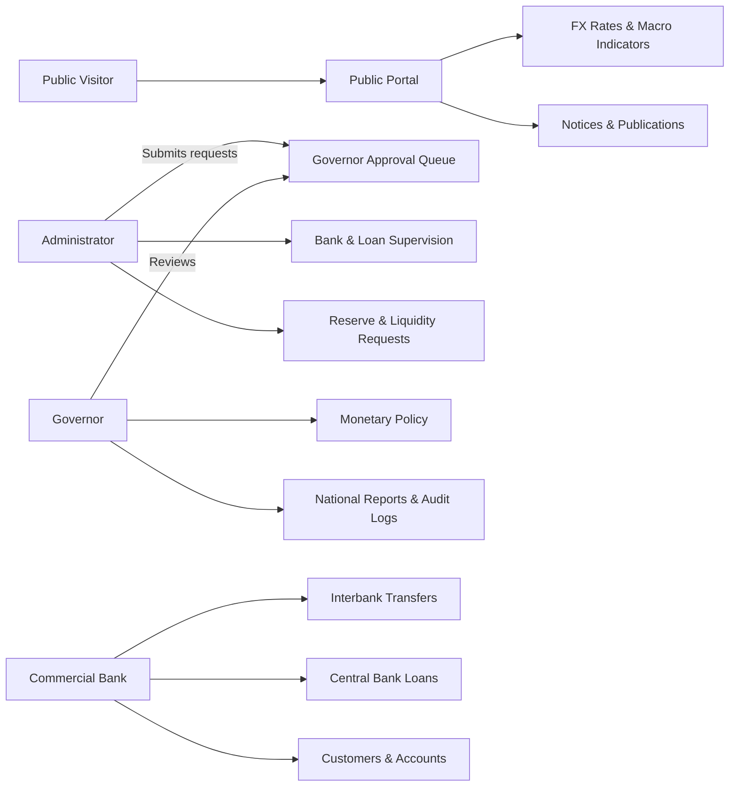

<div align="center">

# 🏛️ Central Banking System

### A Java-powered central banking and financial regulation simulator

<p>
  <strong>Design Project 1 · Group Project · Educational Simulation</strong>
</p>

<p>
  <a href="https://github.com/mdfuadanan/Central-Banking-System"></a>
  <a href="https://maven.apache.org/"></a>
  <a href="https://docs.oracle.com/en/java/javase/25/docs/api/jdk.httpserver/com/sun/net/httpserver/HttpServer.html"></a>
  <a href="#testing"></a>
</p>

<p>
  <a href="#-overview">Overview</a> ·
  <a href="#-key-capabilities">Capabilities</a> ·
  <a href="#-quick-start">Quick Start</a> ·
  <a href="#-user-portals">Portals</a> ·
  <a href="#-documentation">Documentation</a>
</p>

</div>

---

## ✨ Overview

**Central Banking System** is an interactive web-based simulator that demonstrates how a central bank supervises financial institutions and manages national banking operations.

The project combines a built-in Java HTTP server, server-rendered HTML/CSS, role-based access control, CSV persistence, approval workflows, risk scoring, fraud detection, liquidity operations, foreign-exchange rates, and financial reporting — all without a third-party runtime framework or external database.

> 🎓 Built for learning, demonstration, and academic presentation — **not for production banking use**.

## 📊 At a glance

| | |
|---|---|
| **Primary language** | Java |
| **Runtime** | JDK 25 configured; JDK 17+ supported by the manual path |
| **Web server** | Java `com.sun.net.httpserver.HttpServer` |
| **Persistence** | UTF-8 CSV flat files in `data/` |
| **Authentication** | Role-based login with HTTP session cookies |
| **Default ports** | `8080`–`8090` fallback range |
| **External service** | ExchangeRate-API with cached fallback |
| **License** | Free use with required attribution — see [`LICENSE`](LICENSE) |

## 🚀 Key capabilities

<table>
<tr>
<td width="50%">

### 🏦 Banking operations

- Commercial-bank registration and lifecycle management
- Interbank transfers and settlement records
- Customer and account management
- Deposits and withdrawals
- Central-bank loan applications and decisions

</td>
<td width="50%">

### 🏛️ Central-bank supervision

- Governor approval queue
- Monetary policy and reserve-ratio management
- Liquidity injections and absorptions
- Bank risk and net-worth monitoring
- Audit, login, activity, and notification logs

</td>
</tr>
<tr>
<td>

### 🛡️ Risk and security

- Reserve and debt-to-asset risk scoring
- Credit-rating assessment
- Large-transfer and repeated-failure detection
- Structuring-pattern alerts
- Role-protected routes and session validation

</td>
<td>

### 📈 Public information

- Macroeconomic dashboard
- Policy-rate and reserve guidance
- USD/EUR exchange-rate cards
- Public notices and publications
- Customer Interest Protection Center information

</td>
</tr>
</table>

## 🧭 User portals



| Portal | Entry point | Main responsibilities |
|---|---|---|
| 🏛️ **Public** | [`/`](http://localhost:8080/) | Macroeconomic information, FX rates, notices, publications, and CIPC support |
| 🛡️ **Governor** | [`/governor-login`](http://localhost:8080/governor-login) | Approvals, administrators, policy, reserves, oversight, fraud reports, and logs |
| ⚙️ **Administrator** | [`/admin-login`](http://localhost:8080/admin-login) | Bank onboarding, loans, liquidity requests, transactions, and operational reports |
| 🏦 **Commercial Bank** | [`/commercial-bank-login`](http://localhost:8080/commercial-bank-login) | Transfers, loans, customers, accounts, deposits, withdrawals, and bank reports |

## 🏗️ Architecture

```text
Browser
   │ HTTP GET / POST + CBS5SESSION cookie
   ▼
AppRouter ───────────────► SessionManager + LoginManager
   │
   ├──► PageRenderer          Server-rendered HTML/CSS dashboards
   └──► CentralBankSystem     Core banking rules and workflows
          ├── RiskAssessment
          ├── FraudDetector
          ├── ExchangeRateService ──► Live API / cached rates
          ├── ReportService
          └── FileManager ──────────► data/*.csv
```

### Repository map

```text
src/main/java/central_banking_system/
├── CentralBankingSystemApp.java  # Starts the server on ports 8080–8090
├── AppRouter.java                # Routes, forms, login, sessions, and RBAC
├── PageRenderer.java             # Public and authenticated web pages
├── CentralBankSystem.java        # Core domain operations and workflows
├── FileManager.java              # CSV initialization, loading, and saving
├── RiskAssessment.java           # Loan and bank risk scoring
├── FraudDetector.java            # Transfer anomaly and AML checks
├── ExchangeRateService.java      # Live rates and cached fallback
├── ReportService.java             # Text report generation
└── SystemSmokeTest.java           # HTTP and business-flow integration test

data/                              # Runtime CSV data and logs
src/main/resources/assets/          # Logo and web assets
Drawio Files/                       # UML and process diagrams
Screenshots/                        # Interface and diagram screenshots
Project Reports/                    # Proposal and final report
Presentations/                      # Proposal and final presentations
```

## ⚡ Quick start

### Requirements

- **JDK 25** for the configured Maven compiler.
- Windows for the included `.bat` scripts, or a shell with `javac` and `java` available.
- Internet is optional; exchange rates fall back to cached CSV values when the API is unavailable.

### Windows — recommended

```bat
run.bat
```

`run.bat` compiles the project and launches the server. To compile or test separately:

```bat
compile.bat
test.bat
```

### Manual commands

```bash
mkdir -p build
javac -d build src/main/java/central_banking_system/*.java
java -cp build central_banking_system.CentralBankingSystemApp
```

On Windows, copy the resource directory after compilation when using the manual path:

```bat
xcopy /E /I /Y src\main\resources build
```

### Maven

```bash
mvn clean compile
java -cp target/classes central_banking_system.CentralBankingSystemApp
```

The application prints the actual URL when it starts. If port `8080` is busy, it automatically tries through `8090`.

## 🔐 Demo credentials

> These are seeded development credentials. Change or remove them before any real deployment.

| Role | ID | Password | Status |
|---|---|---|---|
| Governor | `GOV001` | `governor123` | Active |
| Administrator | `admin` | `admin123` | Active |
| Delta Commercial Bank | `B001` | `bank123` | Active |
| Padma Islamic Bank | `B002` | `bank123` | Active |
| Meghna Development Bank | `B003` | `bank123` | Suspended |

## 💾 Data and persistence

`FileManager` creates the `data/` directory and seeds missing files on first launch. Runtime records are stored in human-readable CSV files:

- `banks.csv`, `customers.csv`, `accounts.csv`
- `loans.csv`, `transactions.csv`, `operations.csv`
- `reserve.csv`, `policies.csv`, `exchange_rates.csv`
- `approval_requests.csv`, `notifications.csv`
- `governor.csv`, `administrators.csv`
- `audit_logs.csv`, `login_logs.csv`, `activity_logs.csv`

Smoke tests use the isolated `build/test-data/` directory so normal demo data is not modified by the test run.

## ✅ Testing

Run the end-to-end smoke test on Windows:

```bat
test.bat
```

Or manually after compilation:

```bash
java -cp build central_banking_system.SystemSmokeTest
```

The test verifies persistence initialization, the public homepage, exchange-rate display, authentication, session cookies, RBAC redirects, all three protected portals, bank onboarding and Governor approval, banking operations, and report generation.

## 🖼️ Interface preview

<p align="center">
  
  
</p>
<p align="center">
  
  
</p>

## 📚 Documentation

| Resource | Link |
|---|---|
| 📄 Final project report | [Open report](Project%20Reports/Final_Report_Design_Project_1.pdf) |
| 📝 Project proposal | [Open proposal](Project%20Reports/Project_Proposal.docx) |
| 🔄 Activity diagram | [Open diagram](Drawio%20Files/Activity_Diagram.drawio) |
| 🧩 Class diagram | [Open diagram](Drawio%20Files/Class_Diagram.drawio) |
| 🔗 Sequence diagram | [Open diagram](Drawio%20Files/Sequence%20Diagram.drawio) |
| 👥 Use-case diagram | [Open diagram](Drawio%20Files/Use%20Case%20Diagram.drawio) |
| 🖼️ Screenshots | [Browse screenshots](Screenshots/) |
| 🎤 Presentations | [Browse presentations](Presentations/) |

## 📜 License and attribution

This project is free to use, copy, modify, and distribute under the [Central Banking System Free Use and Attribution License](LICENSE).

If you reuse this project or a substantial portion of its code, you must include this attribution in your documentation, README, about page, or another prominent location:

> Based on **Central Banking System** by Md Fuad Anan:  
> https://github.com/mdfuadanan/Central-Banking-System

## ⚠️ Security and scope

This is an educational simulator. It stores demo passwords in CSV files, keeps sessions in memory, and uses Java's lightweight built-in HTTP server. Do not expose it to an untrusted network or use real customer information.

<div align="center">

### Built with Java ☕ · Designed for learning 🎓 · Inspired by central banking 🏛️

<a href="https://github.com/mdfuadanan/Central-Banking-System">⭐ View the repository</a>

</div>
