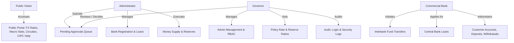

# 🏛️ Central Banking System (Version 9.00)

[](https://www.oracle.com/java/)
[](https://maven.apache.org/)
[](https://docs.oracle.com/en/java/javase/25/docs/api/jdk.httpserver/com/sun/net/httpserver/HttpServer.html)
[](#-data-persistence--csv-schema)
[](#-role-based-access-control-rbac--security)
[](#-testing--verification)

**Central Banking System (Version 9.00)** is a comprehensive core central banking and financial regulatory simulation platform written in pure Java. It models the end-to-end responsibilities of a national apex financial regulator—including monetary policy control, national reserve management, commercial bank supervision, interbank fund settlements, liquidity operations, anti-money laundering (AML) / fraud detection, automated risk scoring, and multi-tier approval workflows.

The system features an embedded HTTP web server and responsive web interface requiring **zero external third-party runtime frameworks**, backed by an automated flat-file CSV database layer.

---

## 📑 Table of Contents

- [🏛️ Central Banking System (Version 9.00)](#️-central-banking-system-version-900)
  - [📑 Table of Contents](#-table-of-contents)
  - [🌟 Key Highlights \& Features](#-key-highlights--features)
  - [🏢 User Roles \& Portal Workflows](#-user-roles--portal-workflows)
    - [1. 🏛️ Public Portal (National Macroeconomic Dashboard)](#1-️-public-portal-national-macroeconomic-dashboard)
    - [2. 🛡️ Governor Portal (Apex Authority)](#2-️-governor-portal-apex-authority)
    - [3. ⚙️ Administrator Portal (Operations \& Supervision)](#3-️-administrator-portal-operations--supervision)
    - [4. 🏦 Commercial Bank Portal (Member Bank Operations)](#4-️-commercial-bank-portal-member-bank-operations)
  - [🔐 Default System Credentials](#-default-system-credentials)
  - [🏗️ System Architecture](#️-system-architecture)
  - [📂 Project Directory Structure](#-project-directory-structure)
  - [🚀 Getting Started](#-getting-started)
    - [Prerequisites](#prerequisites)
    - [Option A: Quick Start via Windows Batch Scripts (Recommended)](#option-a-quick-start-via-windows-batch-scripts-recommended)
    - [Option B: Quick Start via Apache Maven](#option-b-quick-start-via-apache-maven)
    - [Option C: Manual Command-Line Compilation](#option-c-manual-command-line-compilation)
  - [🧪 Testing \& Verification](#-testing--verification)
  - [📊 Data Persistence \& CSV Schema](#-data-persistence--csv-schema)
  - [🛡️ Role-Based Access Control (RBAC) \& Security](#️-role-based-access-control-rbac--security)
  - [📄 License \& Notice](#-license--notice)

---

## 🌟 Key Highlights & Features

- **🌐 Lightweight Embedded HTTP Server**: Uses `com.sun.net.httpserver.HttpServer` with dynamic multi-port binding fallback (ports `8080`–`8090`). No heavy servlet containers or Tomcat/Spring runtime overhead.
- **🛡️ Two-Stage Regulatory Approval Queue**: Sensitive institutional actions (bank licensing, suspension, liquidation, monetary policy updates, reserve ratio revisions) must be initiated by Administrators and vetted/approved with remarks by the Governor.
- **📊 Quantitative Risk Assessment Engine**: Automatically scores commercial bank creditworthiness and loan applications across reserve adequacy, debt-to-asset ratios, credit ratings, outstanding liability exposure, and request sizes (categorized into `LOW`, `MEDIUM`, `HIGH`, `CRITICAL`).
- **🚨 AML & Real-Time Fraud Detector**: Continuously inspects interbank transactions for suspicious behavior including zero/negative transfers, high-velocity transactions, repeated failures, structuring patterns, and negative bank balances.
- **💱 Foreign Exchange (FX) Engine**: Real-time currency tracking and spread calculations (USD, EUR) with live rate fetch capabilities, caching fallback, and spot market reference rates.
- **💰 Liquidity & Reserve Management**: Tracks national reserves against statutory liquidity thresholds and supports open-market operations (OMOs) including capital injection and liquidity absorption.
- **📈 Comprehensive Financial Reporting**: Dynamic report generation across system health, bank net worth, customer summaries, AML anomalies, loan portfolios, and audit trails.
- **💾 Flat-File CSV Persistence Engine**: Fully transactional, human-readable CSV storage with self-healing automatic schema initialization and initial seed data creation upon first launch.

---

## 🏢 User Roles & Portal Workflows



### 1. 🏛️ Public Portal (National Macroeconomic Dashboard)
- **Route**: `GET /` or `GET /home`
- **Features**:
  - Live macroeconomic indicators: Policy Rate (6.50%), Reserve Ratio (10.00%), Inflation Rate, GDP Growth, FX Reserve values.
  - Live & cached foreign exchange ticker for USD and EUR (Buying, Selling, Reference Middle Rate).
  - Public circulars, notices, regulatory publications, and search capability.
  - Customer Interest Protection Center (**CIPC**) emergency hotline (16236) and online complaint submission.

### 2. 🛡️ Governor Portal (Apex Authority)
- **Login Route**: `GET /governor-login` | **Dashboard**: `GET /governor`
- **Features**:
  - **Approval Queue Center**: Review, approve, or reject administrator-submitted requests with mandatory audit remarks (Bank Registrations, Suspensions, Revocations, Monetary Policy Changes, Money Supply Operations).
  - **Administrator Management**: Create, edit, activate/deactivate, reset passwords, or delete system Administrators.
  - **Monetary Policy & Interest Rate Control**: Configure national policy rates and reserve requirements.
  - **Commercial Bank Oversight**: View national bank standings, net-worth rankings, and credit ratings.
  - **National Reports & AML Center**: Real-time fraud detection alerts, national stability assessments, and text-based exportable reports.
  - **Audit & Security Logs**: Comprehensive audit trail inspection, login attempts, and operational activity logs.

### 3. ⚙️ Administrator Portal (Operations & Supervision)
- **Login Route**: `GET /admin-login` | **Dashboard**: `GET /admin`
- **Features**:
  - **Commercial Bank Onboarding**: Draft and submit commercial bank registration applications to the Governor for formal licensing.
  - **Bank Lifecycle Governance**: Initiate bank suspension, liquidation/closure, or resubmission workflows.
  - **Interbank Loan Queue**: Review incoming loan applications, execute quantitative risk analysis, and disburse or reject credit facilities.
  - **Reserve & Liquidity Operations**: Perform money supply injections/absorptions and adjust statutory reserve ratios.
  - **Regulatory Reports**: Generate on-demand system summary reports, loan performance sheets, and risk evaluations.

### 4. 🏦 Commercial Bank Portal (Member Bank Operations)
- **Login Route**: `GET /commercial-bank-login` | **Dashboard**: `GET /bank`
- **Features**:
  - **Interbank Fund Settlement**: Execute direct interbank transfers with real-time balance validation and AML fraud checks.
  - **Central Bank Credit Facility**: Apply for short-term and long-term central bank liquidity loans with automated risk categorization.
  - **Customer & Account Lifecycle**: Register bank customers, manage KYC details, and open/close Savings and Current accounts.
  - **Branch Counter Operations**: Process customer cash deposits and withdrawals with real-time balance synchronization.
  - **Statement & Notifications**: Real-time transaction history, reserve balance compliance alerts, and approval updates.

---

## 🔐 Default System Credentials

| Role | Portal URL | User ID / Login ID | Password | Access Level |
| :--- | :--- | :--- | :--- | :--- |
| **Governor** | [`/governor-login`](http://localhost:8080/governor-login) | `GOV001` | `governor123` | Apex Regulatory & Policy Authority |
| **Administrator** | [`/admin-login`](http://localhost:8080/admin-login) | `admin` | `admin123` | Supervisory & Operational Authority |
| **Commercial Bank (Delta)** | [`/commercial-bank-login`](http://localhost:8080/commercial-bank-login) | `B001` | `bank123` | Active Commercial Bank Member |
| **Commercial Bank (Padma)** | [`/commercial-bank-login`](http://localhost:8080/commercial-bank-login) | `B002` | `bank123` | Active Islamic Bank Member |
| **Commercial Bank (Meghna)** | [`/commercial-bank-login`](http://localhost:8080/commercial-bank-login) | `B003` | `bank123` | Suspended Bank Member |

> [!NOTE]
> For security, the Governor login link is intentionally omitted from public navigation menus and is accessed directly via [`/governor-login`](http://localhost:8080/governor-login).

---

## 🏗️ System Architecture

```
+-------------------------------------------------------------------------------+
|                             Client Web Browser                                |
+---------------------------------------+---------------------------------------+
                                        | HTTP (GET / POST / Cookies)
+---------------------------------------v---------------------------------------+
|                 AppRouter (HttpHandler & RBAC Gatekeeper)                     |
|  - Session Token Validator (CBS5SESSION)                                      |
|  - URL & Query Parameter Parser (UrlUtil)                                     |
|  - Form Body Deserializer & Action Dispatcher                                 |
+-------------------+---------------------------------------+-------------------+
                    |                                       |
+-------------------v-------------------+   +---------------v-------------------+
|             PageRenderer              |   |         CentralBankSystem         |
|  - Dynamic HTML/CSS Component Engine  |   |  - Core Banking Domain Controller |
|  - Responsive Dashboards & Forms      |   |  - RBAC & Credential Validation   |
|  - Status Badges, Tables & Navigation |   |  - Regulatory Approval Pipeline   |
+---------------------------------------+   +---+---+---+---+---+---+---+---+---+
                                                |   |   |   |   |   |   |   |
         +--------------------------------------+   |   |   |   |   |   |   +--------------------------------------+
         |                   +----------------------+   |   |   |   +---+------------------+                   |
         v                   v                          v   v   v                          v                   v
+-----------------+ +-----------------+ +-----------------------------+ +--------------------+ +--------------------+
| RiskAssessment  | |  FraudDetector  | |     ExchangeRateService     | |   ReportService    | |    FileManager     |
| - Debt-to-Asset | | - AML Checks    | | - Live Rate Fetching        | | - System Analytics | | - CSV Flat-File DB |
| - Reserve Ratio | | - Velocity Flags| | - Reference & Spreads       | | - Risk & Fraud Rpts| | - Data Seeding     |
| - Credit Rating | | - Structuring   | | - Cache Persistence         | | - Text Exporters   | | - Transaction Log  |
+-----------------+ +-----------------+ +-----------------------------+ +--------------------+ +---------+----------+
                                                                                                         |
                                                                        +--------------------------------v----------+
                                                                        |               data/*.csv                  |
                                                                        +-------------------------------------------+
```

---

## 📂 Project Directory Structure

```plaintext
Central_Banking_System Version 9.00/
├── compile.bat                  # Windows batch script to compile all Java source files
├── run.bat                      # Windows batch script to build and launch the HTTP server
├── test.bat                     # Windows batch script to run automated smoke integration tests
├── pom.xml                      # Maven project configuration file (Java 25)
├── README.md                    # Project documentation (this file)
│
├── data/                        # Persistent CSV database directory (Auto-initialized)
│   ├── accounts.csv             # Customer accounts and balances
│   ├── activity_logs.csv        # User activity and event audit trail
│   ├── administrators.csv       # Administrator credentials, statuses and metadata
│   ├── approval_requests.csv    # Multi-stage regulatory approval tickets
│   ├── audit_logs.csv           # System-level security and state modification logs
│   ├── banks.csv                # Supervised commercial banks, capital, reserves, assets
│   ├── customers.csv            # Bank customers KYC data and account mappings
│   ├── exchange_rates.csv       # Live and cached foreign exchange rates
│   ├── governor.csv             # Central bank Governor credentials and profile
│   ├── loans.csv                # Central bank credit facilities and status
│   ├── login_logs.csv           # Historical authentication access logs
│   ├── notifications.csv        # Role-targeted notifications and read states
│   ├── operations.csv           # Open-market operations (Injections / Absorptions)
│   ├── policies.csv             # Monetary policy circulars and reserve requirements
│   ├── reserve.csv              # National reserve balance and statutory limits
│   └── transactions.csv         # Interbank transaction ledger and AML flags
│
└── src/
    └── main/
        ├── java/
        │   └── central_banking_system/
        │       ├── Account.java                 # Customer account data model
        │       ├── Administrator.java           # Administrator entity
        │       ├── AppRouter.java               # HTTP request router and RBAC controller
        │       ├── ApprovalRequest.java         # Regulatory approval ticket model
        │       ├── ApprovalStatus.java          # Enum (PENDING, APPROVED, REJECTED, CANCELLED)
        │       ├── ApprovalType.java            # Enum for regulatory approval actions
        │       ├── BankStatus.java              # Enum (ACTIVE, SUSPENDED, PENDING_APPROVAL, etc.)
        │       ├── BankType.java                # Enum (COMMERCIAL, ISLAMIC, SPECIALIZED)
        │       ├── CentralBank.java             # Apex regulatory institution entity
        │       ├── CentralBankSystem.java       # Central system coordinator and business logic
        │       ├── CentralBankingSystemApp.java # Main server application entry point
        │       ├── CommercialBank.java          # Commercial bank entity model
        │       ├── CsvUtil.java                 # CSV serialization and RFC 4180 parsing utility
        │       ├── Customer.java                # Bank customer model
        │       ├── CustomerStatus.java          # Enum (ACTIVE, DORMANT, SUSPENDED, FROZEN)
        │       ├── ExchangeRate.java            # Currency exchange model
        │       ├── ExchangeRateService.java     # FX rates retrieval and caching service
        │       ├── FileManager.java             # File storage and CSV persistence engine
        │       ├── FinancialInstitution.java    # Base financial entity class
        │       ├── FraudDetector.java           # Anti-Money Laundering & anomaly detector
        │       ├── Governor.java                # Governor entity and credentials model
        │       ├── IdGenerator.java             # Thread-safe sequential unique ID generator
        │       ├── LiquidityOperation.java      # Money supply and market liquidity model
        │       ├── Loan.java                    # Interbank loan model
        │       ├── LoanStatus.java              # Enum (PENDING, APPROVED, DISBURSED, REPAID, etc.)
        │       ├── LoanType.java                # Enum (SHORT_TERM, LONG_TERM, EMERGENCY)
        │       ├── LoginManager.java            # Credential verification engine
        │       ├── MonetaryPolicy.java          # Monetary policy definition
        │       ├── Notification.java            # System notification model
        │       ├── NumberUtil.java              # Currency formatting and math helpers
        │       ├── OperationStatus.java         # Enum (COMPLETED, PENDING, CANCELLED)
        │       ├── OperationType.java           # Enum (INJECTION, ABSORPTION)
        │       ├── PageRenderer.java            # Server-side HTML/CSS/JS page generator
        │       ├── Regulator.java               # Regulatory compliance entity
        │       ├── Report.java                  # Report model interface
        │       ├── ReportService.java           # Financial analytics and reporting engine
        │       ├── ReportType.java              # Enum for report categories
        │       ├── Reserve.java                 # Central bank national reserve model
        │       ├── RiskAssessment.java          # Credit and institutional risk calculator
        │       ├── RiskLevel.java               # Enum (LOW, MEDIUM, HIGH, CRITICAL)
        │       ├── RiskResult.java              # Risk evaluation container
        │       ├── SessionManager.java          # In-memory HTTP cookie session tracker
        │       ├── SystemSmokeTest.java         # Full integration and HTTP smoke test suite
        │       ├── TextReport.java              # Formatted plaintext report generator
        │       ├── Transaction.java             # Interbank transaction ledger record
        │       ├── TransactionStatus.java       # Enum (SUCCESS, FAILED, FLAGGED)
        │       ├── UrlUtil.java                 # URL decoding and query string parser
        │       ├── UserRole.java                # Enum (GOVERNOR, ADMINISTRATOR, COMMERCIAL_BANK)
        │       └── UserSession.java             # Authenticated user session representation
        └── resources/
            └── assets/
                └── central-bank-logo.png        # Official UI brand asset
```

---

## 🚀 Getting Started

### Prerequisites
- **Java Development Kit (JDK)**: Java 17 or higher (Java 25 recommended).
- **Operating System**: Windows (tested with native batch scripts), Linux, or macOS.

---

### Option A: Quick Start via Windows Batch Scripts (Recommended)

1. **Compile the Project**:
   ```cmd
   compile.bat
   ```
2. **Run the Application**:
   ```cmd
   run.bat
   ```
3. **Open the Browser**:
   - Public Portal: [http://localhost:8080](http://localhost:8080)
   - Governor Login: [http://localhost:8080/governor-login](http://localhost:8080/governor-login)
   - Admin Login: [http://localhost:8080/admin-login](http://localhost:8080/admin-login)
   - Commercial Bank Login: [http://localhost:8080/commercial-bank-login](http://localhost:8080/commercial-bank-login)

---

### Option B: Quick Start via Apache Maven

1. **Compile with Maven**:
   ```bash
   mvn clean compile
   ```
2. **Run the Application**:
   ```bash
   mvn exec:java
   ```

---

### Option C: Manual Command-Line Compilation

1. **Compile Java Files to `build` directory**:
   ```bash
   mkdir build
   javac -d build src/main/java/central_banking_system/*.java
   ```
2. **Start the Application**:
   ```bash
   java -cp build central_banking_system.CentralBankingSystemApp
   ```

---

## 🧪 Testing & Verification

The project includes an end-to-end integration and HTTP smoke test suite in [`SystemSmokeTest.java`](file:///d:/Codes/Java/Central%20Banking%20System/Central_Banking_System%20Version%209.00/src/main/java/central_banking_system/SystemSmokeTest.java).

The smoke test automatically verifies:
1. File persistence initialization and sample data seeding in isolated test storage.
2. Interbank credit application, risk calculation, and ledger recording.
3. System report synthesis and financial summary validation.
4. HTTP web server startup and public homepage content.
5. Strict Role-Based Access Control (RBAC) boundary enforcement (unauthorized redirects, session isolation).
6. Administrator, Commercial Bank, and Governor authentication mechanisms.
7. Commercial Bank onboarding workflow from Admin proposal to Governor review and activation.

### Running the Smoke Tests

- **Via Batch Script**:
  ```cmd
  test.bat
  ```
- **Via CLI**:
  ```bash
  java -cp build central_banking_system.SystemSmokeTest
  ```

**Expected Output:**
```plaintext
Smoke test passed: compile, homepage, RBAC, logins, approvals, banking operations and reports are working.
```

---

## 📊 Data Persistence & CSV Schema

All records are persisted into human-readable CSV files inside the `data/` directory using UTF-8 encoding. If the folder or files do not exist, [`FileManager`](file:///d:/Codes/Java/Central%20Banking%20System/Central_Banking_System%20Version%209.00/src/main/java/central_banking_system/FileManager.java) automatically initializes them with verified sample seed data.

| File Name | Schema / Fields | Description |
| :--- | :--- | :--- |
| `banks.csv` | `id, name, licenseNo, type, address, capital, status, riskLevel, activatedOn, currentBalance, reserveBalance, assets, liabilities, creditRating, password, contactEmail` | Commercial bank master directory and financial balance sheets |
| `customers.csv` | `customerId, bankId, name, email, status, accountId` | Commercial bank customers and KYC profiles |
| `accounts.csv` | `accountId, customerId, bankId, accountType, balance, active` | Customer deposit accounts and active balances |
| `loans.csv` | `loanId, bankId, type, amount, interestRate, startDate, endDate, status, riskScore, riskLevel, comments` | Interbank credit applications and risk scoring |
| `transactions.csv` | `transactionId, senderBankId, receiverBankId, amount, dateTime, status, description` | Real-time interbank transaction clearing ledger |
| `reserve.csv` | `nationalReserve, minimumRequiredReserve, lastUpdated` | Central bank foreign exchange and national reserves |
| `operations.csv` | `operationId, operationType, amount, targetBankId, date, status` | Open-market liquidity operations |
| `policies.csv` | `policyId, policyName, interestRate, reserveRequirement, effectiveFrom, effectiveTo, description` | Monetary policy directives and statutory reserve ratios |
| `exchange_rates.csv` | `currencyCode, currencyName, referenceRate, buyingRate, sellingRate, lastUpdated, source` | Spot FX rates and spreads |
| `approval_requests.csv` | `requestId, adminId, adminName, requestType, description, submittedAt, status, remarks, governorId, approvalTime, targetId, payload` | Institutional approval queue for Governor vetting |
| `administrators.csv` | `adminId, name, password, email, enabled, createdOn, lastPasswordReset` | Administrator access accounts |
| `governor.csv` | `governorId, name, password, email` | Governor master profile and credentials |
| `notifications.csv` | `notificationId, recipientRole, recipientId, message, createdAt, isRead` | In-app user notifications |
| `audit_logs.csv` | `timestamp, message` | Immutable system and administrative audit trail |
| `login_logs.csv` | `timestamp, message` | Security authentication history |
| `activity_logs.csv` | `timestamp, message` | Operational events and workflow updates |

---

## 🛡️ Role-Based Access Control (RBAC) & Security

The system implements strict role-based access control via [`AppRouter`](file:///d:/Codes/Java/Central%20Banking%20System/Central_Banking_System%20Version%209.00/src/main/java/central_banking_system/AppRouter.java) and [`SessionManager`](file:///d:/Codes/Java/Central%20Banking%20System/Central_Banking_System%20Version%209.00/src/main/java/central_banking_system/SessionManager.java).

- **Session Tokens**: Authenticated users receive an encrypted HTTP session cookie (`CBS5SESSION`).
- **Access Verification**: Every protected route verifies user role before rendering dashboard components or executing state-modifying POST requests.
- **Unauthorized Interception**: Accessing unauthorized endpoints automatically redirects to the respective credential login screen with HTTP `303 See Other`.

| Endpoint Path | Method | Required Role | Description |
| :--- | :--- | :--- | :--- |
| `/` , `/home`, `/about`, `/policy-rate`, `/reserve-ratio`, `/interbank-exchange-rate`, `/cipc`, `/notices`, `/news`, `/publications` | `GET` | **Public** (Unauthenticated) | Macroeconomic overview, circulars, FX rates |
| `/login`, `/admin-login`, `/commercial-bank-login`, `/governor-login` | `GET` / `POST` | **Public** (Unauthenticated) | Authentication gates |
| `/logout` | `GET` | **Any Authenticated** | Invalidates session and clears cookie |
| `/admin`, `/admin/*` | `GET` / `POST` | **Administrator** | Commercial bank supervision, loan queues, money supply |
| `/bank`, `/bank/*` | `GET` / `POST` | **Commercial Bank** | Interbank transfers, customer accounts, deposits/withdrawals |
| `/governor`, `/governor/*` | `GET` / `POST` | **Governor** | Approval queue review, admin management, monetary policy |

---

## 📄 License & Notice

Developed as a Central Banking and Regulatory Simulation Platform. All monetary calculations, regulatory approval patterns, and AML fraud rules are implemented according to standard central banking supervision guidelines.
